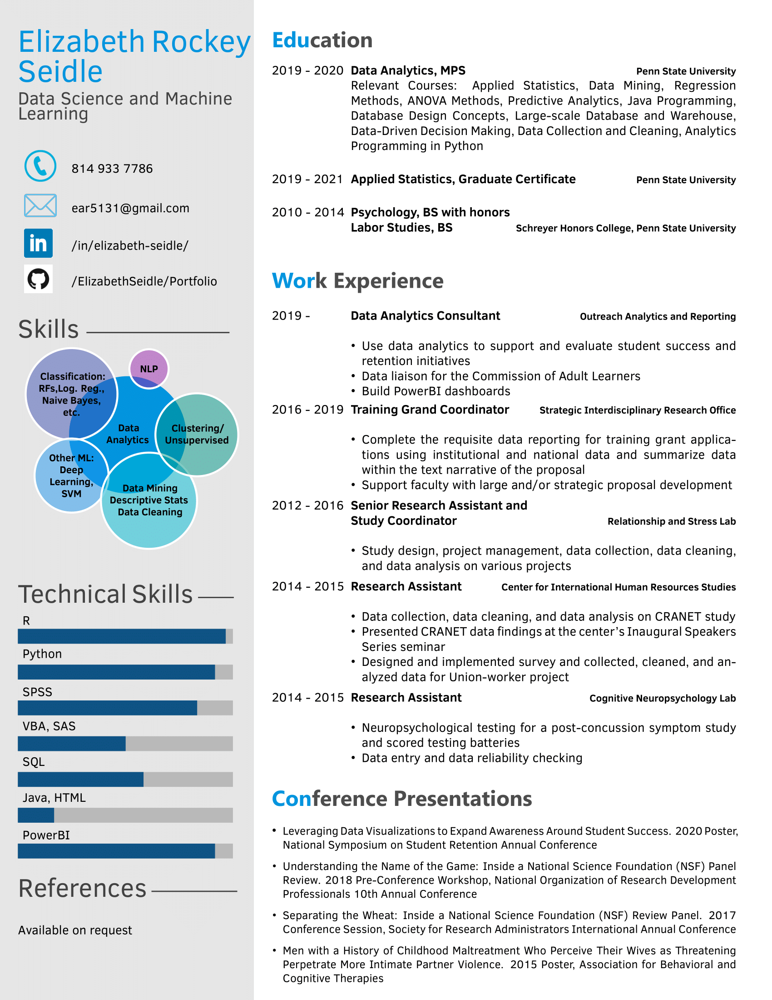

# Portfolio

## Projects
- [NYC Tree Census Project, in collaboration with Kyle Foerster](https://github.com/kbfoerster/nyctrees)
- [Network Data Visualization](https://github.com/ElizabethSeidle/Portfolio/tree/master/Network%20Graphic)
- [NLP: LDA and Sentiment Analysis](OtherProjects/COVID_Pubs_Wk_4.ipynb)
- [Image Classification (Tensorflow)](https://github.com/kbfoerster/GroceryFeathersClassification)

## Resume
[LinkedIn](https://www.linkedin.com/in/elizabeth-seidle/)  

 
