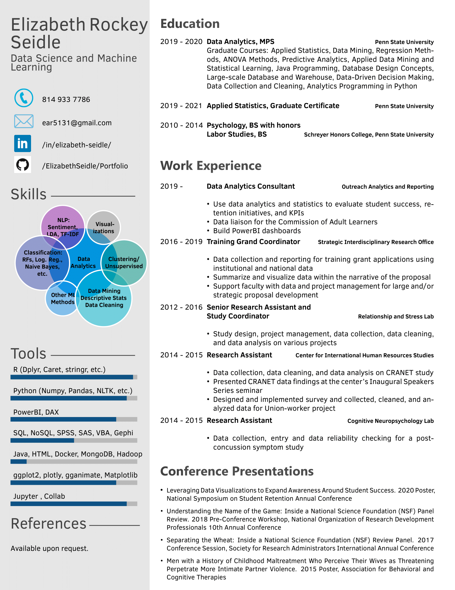

# Portfolio

## Projects
- [Network Data Visualization (Python and Gephi)](https://github.com/ElizabethSeidle/Portfolio/tree/master/Network%20Graphic)
- [NLP: LDA and Sentiment Analysis (Python)](OtherProjects/COVID_Pubs_Wk_4.ipynb)

## Collaborative Projects
- [Image Classification (Python/Tensorflow)](https://github.com/kbfoerster/GroceryFeathersClassification)
- [NYC Tree Census Project (R and Python)](https://github.com/kbfoerster/nyctrees)

## Resume
[LinkedIn](https://www.linkedin.com/in/elizabeth-seidle/)  

 
